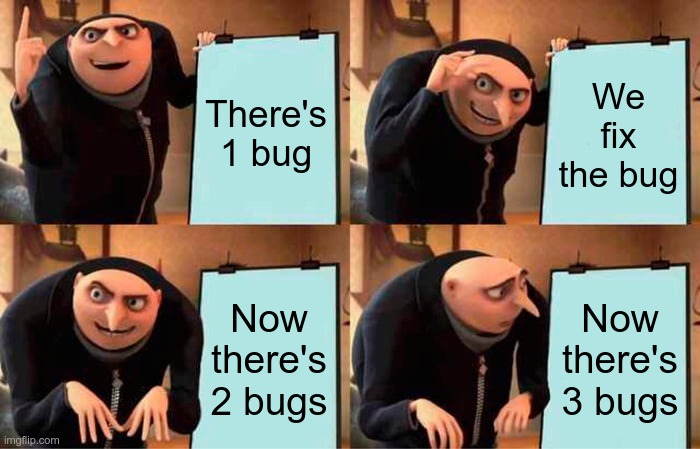

# The Plan



> _Pictured above: what we want to avoid._

Any project should start with the following questions:

1) Who is it for?
2) What do they want?
3) Why do they need it?

Since this is actually a Technical Test, for a Tech Lead position at Coffreo,
communication with the stakeholders is possible however sparse due to the 1
week deadline. So we'll extrapolate as much as we can to save time.

Let's answer those questions now, using the standard Gherkin syntax:

```gherkin
Feature: Technical Test
    As the Head of Engineering of Coffreo
    In order to demonstrate the candidates' technical competency
        And assess their problem solving and logical thinking
    I need to evaluate the candidates' ability to perform the tasks required for the role

    Background:
        Given the candidate's sent access to their repository
```

The technical test comprises a [GitHub repository](https://github.com/Coffreo/recruitment-challenge)
containing:

```console
.
├── .dockerignore
├── .gitignore
├── composer.json
├── docker-compose.yaml
├── Dockerfile
├── Makefile
├── Readme.md
└── src/
    ├── capital.php
    └── country.php
```

The two PHP files are RabbitMQ workers that consume and publish country related
data fetched from restcountries.com, and the main objectives are:

+ implementing an efficient communication between workers
+ interact properly with an external API and process the fetched data
+ manage errors and failure scenarios in a stable and well thought manner
+ organise and document the code, to help maintenance and comprehension
+ use third party libraries and component that are strictly required
+ justify the technical decisions, especially the choice of libraries
+ modify `Dockerfile` / `docker-component.yaml` to make deployment a breeze
+ add a CI/CD pipeline for tests and deployment
+ provide a deliverable that's easily executable, with instructions on how to test the app

After having a quick look at the project, we can make the following plan,
in the form of User Stories (using standard Gherkin format).

## PLN-01: Code Review

The first thing to do will be a Code Review:

```gherkin
    Scenario: Code Review
        When I check the `/doc/PLN-01-code-review.md` document
        Then I should find an assessment of the code that identifies:
            - bugs
            - securitry issues
            - performance issues
            - quality issues
            - scalability issues
        And specifies solutions as to how to address them
```

## PLN-02: Executable Application

Next we'll make sure we can run the application as it is:

```gherkin
    Scenario: Executable Application
        When I check the `/doc/PLN-02-executable-application.md` document
        Then I should find steps describing how to install and run the application
```

## PLN-03: Automated Tests

To prepare for the next part and make sure we don't break things we're not
supposed to, we'll write some tests:

```gherkin
    Scenario: Automated Tests
        When I check the `/doc/PLN-03-automated-tests.md` document
        Then I should find steps describing how to run the test suite
        And running `make test` should have all tests pass successfully
```

## PLN-04: Refactoring

After that, probably the biggest part of the challenge will be the actual
refactoring:

```gherkin
    Scenario: Refactoring
        When I check the `/doc/PLN-04-refactoring.md` document
        Then I should find a report explaining what changed and why
        And I should see the improvements that were highlited in `/doc/PLN-01-code-review.md`
        And I should see the code changes in the project (commits, `src`, `doc`, `tests`, `bin`, `config`, etc)
        And running `make test` should still have all tests pass successfully
```

## PLN-05: Tech Stack

It's during the refactoring that some choices will be made, especially
regarding the use of third party libraries and components:

```gherkin
    Scenario: Tech Stack
        When I check the `/doc/PLN-05-tech-stack.md` document
        Then I should see the list of third party libraries used
        And the reason why they were necessary
```

## PLN-06: DevOps

The requirements of the challenge explicitly mention
Continuous Integration / Continuous Deployment:

```gherkin
    Scenario: DevOps
        When I check the `/doc/PLN-06-devops.md` document
        Then I should find documentation on how to deploy the app
        And the explanation for the changes made to the following files / folders:
            - `/Dockerfile`
            - `/docker-compose.yaml`
            - `/.github/workflows/`
```

## Deliverable

At the end of the one week deadline, the following GitHub repository will be
made public and communicated via the relevant channels:
https://github.com/gnugat/coffreo-recruitment-challenge.

This should be considered "the deliverable": it's a fork of the original
repository, and it contains the commits made during the challenge.
